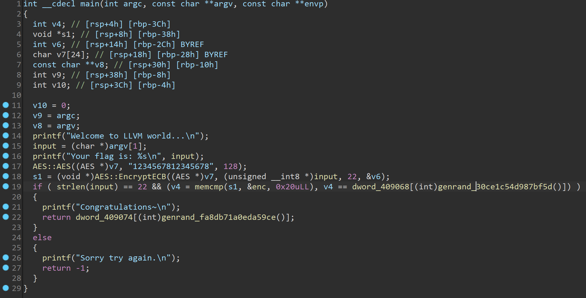

# TrapAngr
## Description
This pass will replace each constant value with a function call, which contains random array indexing and eventually returns a same value as the replaced constant.
\
\
The code in each function is equivalent to `return arr[rand() % 3]`. `arr` is a global array of three elements, and they are all equal to the replaced constant. The function looks like the image following:
\
\

\
\
That will make angr got stuck while performing symbolic execution. As angr will calculate the max value of the index if it is a symbolic value, but angr cannot calculate the max value of [fast remainder](https://reverseengineering.stackexchange.com/questions/1397/how-can-i-reverse-optimized-integer-division-modulo-by-constant-operations) operation somehow, it breaks down. In other words, we exploit the features of angr's memory Symbolic Memory Addressing strategies and the limitation of z3 solver.
\
\
The remainder operation usually optimized by the compiler (which is called fast remainder optimization). In this pass, I wrote an fast remainder of 3 myself, and obfuscated it via [Variable Substitution](llvm/lib/Transforms/Obfuscation/VariableSubstitution.cpp) to make it more confusing. 

## Available Compiler Options
- `-mllvm -trap-angr-times=3`: Run TrapAngr pass 3 times. Default: 1
- `-mllvm -trap-angr-prob=60`: Each constant will be substituted with a probability of 40%. Default: 40
## Obfuscation Result
You can find the obfuscated binary at [obfu-examples/build/trap-angr.out](obfu-examples/build/trap-angr.out)
\
\

\
\
